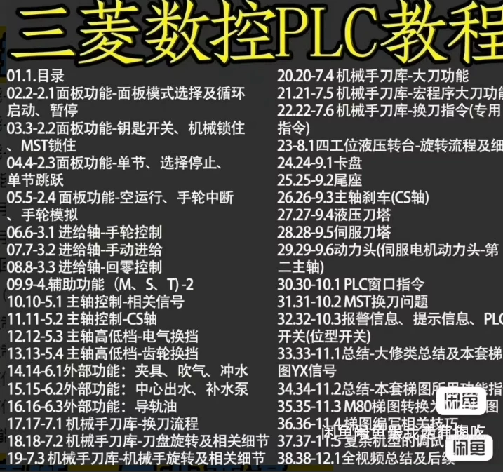
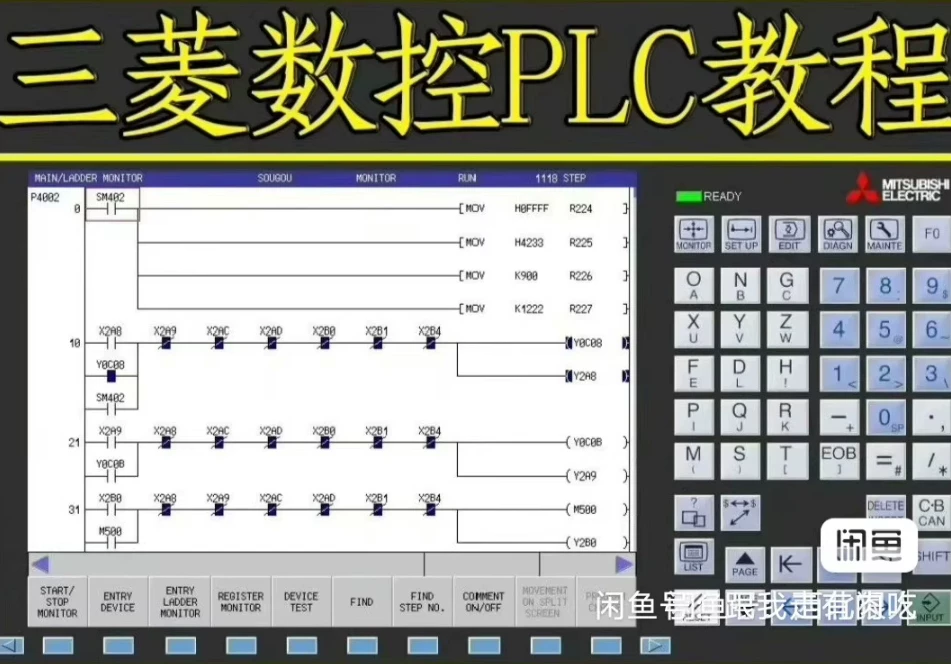
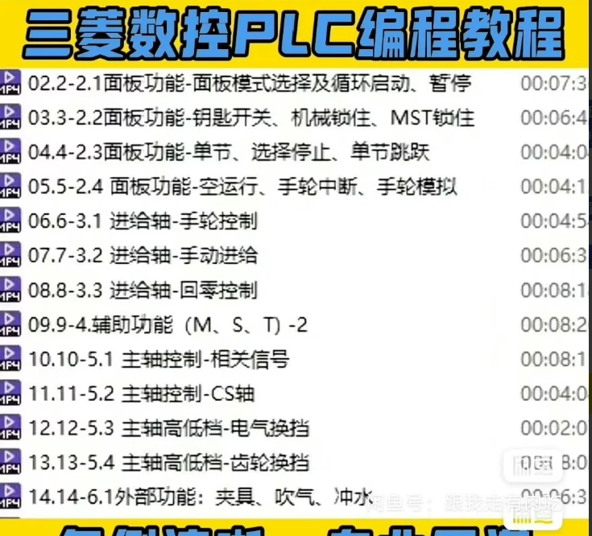
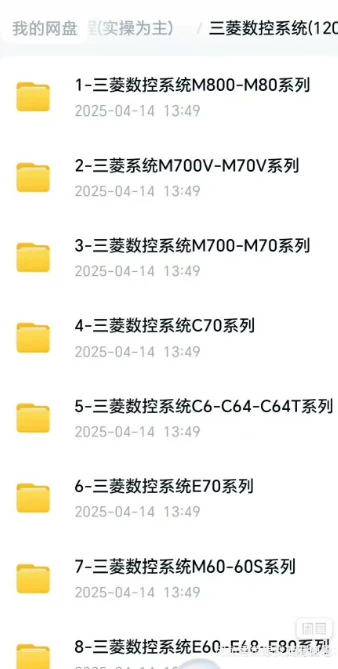
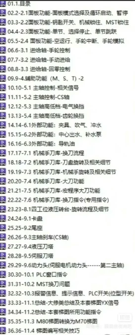

# Mitsubishi CNC Machine Tools and PLC Full Set of High-quality Self-taught Video Tutorials (Practical Focus)

## Body

This is a comprehensive video tutorial on learning how to use the PLC (Programmable Logic Controller) system in Mitsubishi CNC machine tooling. The tutorial focuses on practical operations, providing step-by-step guidance for beginners.

(Full product description was not available from the source page.)

## Images

## Payment

Here is a pay link on Stripe ( https://buy.stripe.com/3cs8yP7sY87d0vu9AB ). Please contact me lonlonago@foxmail.com after funding $89, and I will send you a complete data files , thank you!

